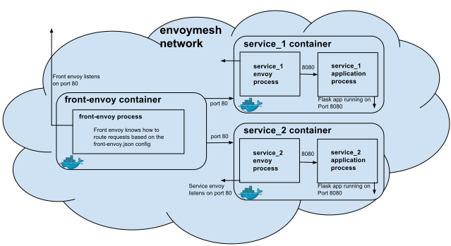

# 使用`envoy`组成服务网格



## 启动

```sh
docker-comose up -d #启动测试服务
docker-compose ps #查看启动的容器
```

## 测试

- 访问 `service1`

```sh
curl -v localhost:8000/service/1
```

- 访问 `service2`

```sh
curl -v localhost:8000/service/2
```

- 负载均衡

```sh
docker-compose scale service1=3 #启动s三个ervice1实例
curl -v localhost:8000/service/1 #测试service1
```
