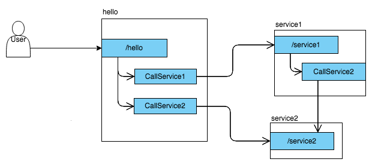
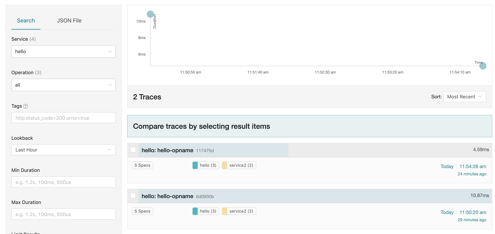

# jaeger poc

Jaeger 是由 Uber 开发的一套全链路追踪方案，符合 Opentracing 协议规范。Jaeger 的全链路追踪功能主要由三个角色完成：

client（负责全链路上各个调用点的计时、采样，并将 tracing 数据发往本地 agent）

agent（负责收集 client 发来的 tracing 数据，并以 thrift 协议转发给 collector

collector（负责搜集所有 agent 上报的 tracing 数据，统一存储）。


## docker运行jaeger的测试环境

```sh
docker run -d --name jaeger \
  -e COLLECTOR_ZIPKIN_HTTP_PORT=9411 \
  -p 5775:5775/udp \
  -p 6831:6831/udp \
  -p 6832:6832/udp \
  -p 5778:5778 \
  -p 16686:16686 \
  -p 14268:14268 \
  -p 9411:9411 \
  jaegertracing/all-in-one:1.11
```

**端口配置说明**

    Port	Protocol	Component	Function
    5775	UDP	agent	accept zipkin.thrift over compact thrift protocol (deprecated, used by legacy clients only)
    6831	UDP	agent	accept jaeger.thrift over compact thrift protocol
    6832	UDP	agent	accept jaeger.thrift over binary thrift protocol
    5778	HTTP	agent	serve configs
    16686	HTTP	query	serve frontend
    14268	HTTP	collector	accept jaeger.thrift directly from clients
    14250	HTTP	collector	accept model.proto
    9411	HTTP	collector	Zipkin compatible endpoint (optional)

## demo测试

本教程的 Demo 包含三个服务，分别是 hello，service1，service2，三个服务的依赖关系如下图：



demo源码结目录构

    demo
    ├── client
    │   └── hello.go
    ├── lib
    │   └── tracing
    │       └── init.go
    ├── service1
    │   └── service1.go
    └── service2
        └── service2.go

client/hello.go 是 hello 服务源码，监听 10080 端口，对外接口 http://127.0.0.1:10080/hello，
服务启动命令 go run hello.go。

service1/service1.go 是 service1 服务源码，监听 10081 端口，对外接口 http://127.0.0.1:10081/service1，
服务启动命令 go run service1.go。

service2/service2.go 是 service2 服务源码，监听 10082 端口，对外接口 http://127.0.0.1:10082/service2，
服务启动命令 go run service2.go。


浏览器访问 http://127.0.0.1:16686/search


在jaeger ui查看 tracing

