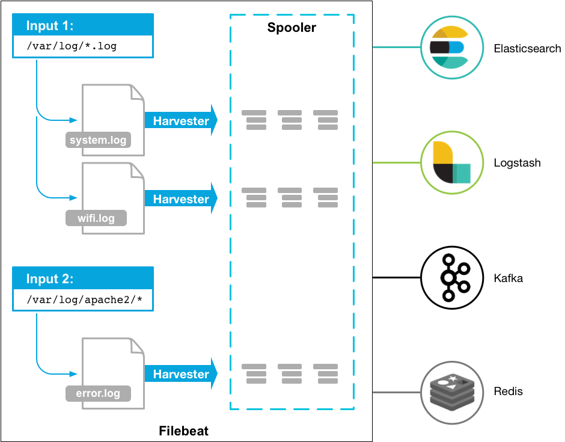

# filebat理解

## 架构



针对每个日志文件，Filebeat都会启动一个harvester协程，即一个goroutine，在该goroutine中不停的读取日志文件，直到文件的EOF末尾。

不同的harvester goroutine采集到的日志数据都会发送至一个全局的队列queue中，queue的实现有两种：基于内存和基于磁盘的队列，目前基于磁盘的队列还是处于alpha阶段，Filebeat默认启用的是基于内存的缓存队列。

每当队列中的数据缓存到一定的大小或者超过了定时的时间（默认1s），会被注册的client从队列中消费，发送至配置的后端。目前可以设置的client有Kafka、Elasticsearch、Redis等。

虽然这一切看着挺简单，但在实际使用中，我们还是需要考虑更多的问题，例如：

- 日志文件是如何被Filbebeat发现又是如何被采集的？
- Filebeat是如何确保日志采集发送到远程的存储中，不丢失一条数据的？
- 如果Filebeat挂掉，下次采集如何确保从上次的状态开始而不会重新采集所有日志？
- Filebeat的内存或者CPU占用过多，该如何分析解决？
- Filebeat如何支持Docker和Kubernetes，如何配置容器化下的日志采集？
- 想让Filebeat采集的日志发送至的后端存储，如果原生不支持，怎样定制化开发？


Filebeat大概可以分以下几个模块：
input：找到配置的日志文件，启动harvester
harvester：读取文件，发送至spooler
spooler：缓存日志数据，直到可以发送至publisher
publisher：发送日志至后端，同时通知registrar
registrar：记录日志文件被采集的状态

## 性能分析与调优


虽然beats系列主打轻量级，虽然用Golang写的Filebeat的内存占用确实比较基于JVM的Logstash等好太多，但是事实告诉我们其实没那么简单。
正常启动Filebeat，一般确实只会占用3、40MB内存

究其原因，一般容器化环境中，特别是裸机上运行的容器个数可能会比较多，导致创建大量的harvester去采集日志。如果没有很好的配置Filebeat，会有较大概率导致内存急剧上升。

当然，Filebeat内存占据较大的部分还是MemQueue，所有采集到的日志都会先发送至MemQueue聚集，再通过output发送出去。每条日志的数据在Filebeat中都被组装为event结构，Filebeat默认配置的MemQueue缓存的event个数为4096，可通过queue.mem.events设置。默认最大的一条日志的event大小限制为10MB，可通过max_bytes设置。4096 * 10MB = 40GB，可以想象，极端场景下，Filebeat至少占据40GB的内存。特别是配置了multiline多行模式的情况下，如果MultiLine配置有误，单个event误采集为上千条日志的数据，很可能导致MemQueue占据了大量内存，致使内存爆炸。

## 如何对Filebeat进行扩展开发

一般情况下Filebeat可满足大部分的日志采集需求，但是仍然避免不了一些特殊的场景需要我们对Filebeat进行定制化开发，当然Filebeat本身的设计也提供了良好的扩展性。

beats目前只提供了像Elasticsearch、Kafka、Logstash等几类output客户端，如果我们想要Filebeat直接发送至其他后端，需要定制化开发自己的output。同样，如果需要对日志做过滤处理或者增加元信息，也可以自制processor插件。

## 最佳实践

- https://coralogix.com/log-analytics-blog/filebeat-configuration-best-practices-tutorial/


## 示例

This example uses a simple log input, forwarding only errors and critical log lines to Coralogix’s Logstash server (output). The Chosen application name is “prd” and the subsystem is “app”, you may later filter logs based on these metadata fields. You may add any other custom fields to your logs in order to have more filter options.

```yaml
 ============================== Filebeat Inputs ===============================

filebeat.inputs:
# Use the log input to read lines from log files
- type: log
  # Path of files
  paths:
  - "/var/log/application.log"
  # Include lines. A list of regular expressions to match. It exports the lines that are
  # matching any regular expression from the list. The include_lines is called before
  # exclude_lines. By default, all the lines are exported.
  include_lines: ['^CRITICAL', '^ERROR', '^ERR']
  # Generally, When set to true, the custom fields are stored as top-level fields in the output document instead of being grouped under a fields sub-dictionary.
  # In Coralogix it's a bit different, if you want to add custom fields then you must set fields under root true.
  # This will also add all metadata from fielbeat similar to the native use of this option.
  fields_under_root: true
  # These are the required fields for our integration with filebeat
  fields:
    PRIVATE_KEY: "xxxxxxxx-xxxx-xxxx-xxxx-xxxxxxxxxxxx"
    COMPANY_ID: xxxx
    APP_NAME: "prd"
    SUB_SYSTEM: "app"
    # Custom field
    filename: "application.log"

# ================================= Logstash output =================================

output.logstash:
  enabled: true
  # output to Coralogix Logstash server
  hosts: ["logstashserver.coralogix.com:5044"]
```