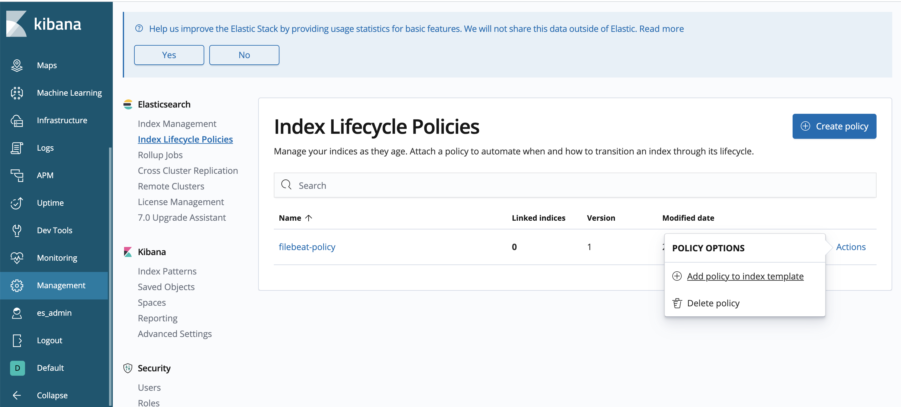

# 通过索引生命周期管理filebeat数据

## 参考链接

- https://www.elastic.co/guide/en/beats/filebeat/6.8/ilm.html

## 背景信息

| 阶段   | 描述                                                                                               |
| ------ | -------------------------------------------------------------------------------------------------- |
| hot    | 主要处理时序数据的实时写入。可根据索引的文档数、大小、时长决定是否调用rollover API来滚动更新索引。 |
| warm   | 索引不再写入，主要用来提供查询。                                                                   |
| cold   | 索引不再更新，查询很少，查询速度会变慢。                                                           |
| delete | 数据将被删除。                                                                                     |

本文使用的测试场景如下：

业务场景中存在大量的heartbeat-*时序索引，并且每天单个索引大小都为4MB左右。当数据越来越多时，shard数量也会越来越多，导致集群负载增加。所以需要指定不同的滚动更新策略，在hot阶段滚动更新heartbeat-*开头的历史监控索引，warm阶段对索引进行分片收缩及段合并，cold阶段将数据从hot节点迁移到warm（冷数据）节点，delete阶段定期删除索引数据。

## 操作流程

### 步骤一：在Heartbeat下配置ILM

```yaml
filebeat.config:
    inputs:
    # Mounted `filebeat-inputs` configmap:
    path: ${path.config}/inputs.d/*.yml
    # Reload inputs configs as they change:
    reload.enabled: false
    modules:
    path: ${path.config}/modules.d/*.yml
    # Reload module configs as they change:
    reload.enabled: false

# Uncommnet this part and remove `filebeat.config.inputs` when running in Openshift and cri-o
#filebeat.autodiscover:
#  providers:
#     - type: kubernetes
#       include_pod_uid: true
#       templates:
#         - condition.regexp:
#             kubernetes.container.name: '.+'
#           config:
#             - type: docker
#               containers:
#                 path: "/var/log/pods/*${data.kubernetes.pod.uid}/"
#                 ids:
#                   - "${data.kubernetes.container.name}"

# To enable hints based autodiscover, remove `filebeat.config.inputs` configuration and uncomment this:
#filebeat.autodiscover:
#  providers:
#    - type: kubernetes
#      hints.enabled: true

processors:
    - add_kubernetes_metadata: ~
    - add_host_metadata: ~
    - add_cloud_metadata: ~
    - add_locale: ~

cloud.id: ${ELASTIC_CLOUD_ID}
cloud.auth: ${ELASTIC_CLOUD_AUTH}

output.elasticsearch:
    hosts: ['${ELASTICSEARCH_HOST:elasticsearch}:${ELASTICSEARCH_PORT:9200}']
    username: ${ELASTICSEARCH_USERNAME}
    password: ${ELASTICSEARCH_PASSWORD}
    ilm.enabled: true
    ilm.rollover_alias: "filebeat"
    ilm.pattern: "{now/d}-000001"
```

部分参数说明如下，更多参数说明请参见官方Heartbeat配置文档。

| 参数                                      | 说明                                                                                                                                      |
| ----------------------------------------- | ----------------------------------------------------------------------------------------------------------------------------------------- |
| index.number_of_shards                    | 设置主分片数，默认是1。                                                                                                                   |
| index.routing.allocation.require.box_type | 设置将索引数据写入hot节点。                                                                                                               |
| ilm.enabled                               | 设置为true，表示启用索引生命周期管理ILM。                                                                                                 |
| setup.template.overwrite                  | 设置是否覆盖原索引模板。如果您已经将此版本的索引模板加载到Elasticsearch中，则必须将该参数设置为true，使用此版本的索引模板覆盖原索引模板。 |
| ilm.rollover_alias                        | 设置滚动更新索引时，生成的索引的别名，默认是heartbeat-\{beat.version\}。                                                                  |
| ilm.pattern                               | 设置滚动更新索引时，生成的索引的模式。支持date math，默认是{now/d}-000001。当触发索引滚动更新条件后，新的索引名称会在最后一位数字上加1。  |
例如第一次滚动更新产生的索引名称是heartbeat-2020.04.29-000001，当满足索引滚动更新条件后触发滚动，Elasticsearch会创建新的索引，名称为heartbeat-2020.04.29-000002。

***注意 如果在加载索引模板后修改ilm.rollover_alias或ilm.pattern，则必须设置setup.template.overwrite为true，重写索引模板。***

#### 更改索引名称和lifecycle名称

```yaml
setup.template.name: "customname"
setup.template.pattern: "customname-*"
setup.template.settings.index.lifecycle.rollover_alias: "customname"
setup.template.settings.index.lifecycle.name: "beats-default-policy"
```

***注意：设置以上自定义参数时，请不要设置ilm.enabled，否则配置文件中指定的设置将被覆盖。***

### 步骤二：创建ILM策略

Elasticsearch支持通过API和Kibana控制台操作两种方式创建ILM策略。以下示例以API方式为例，介绍通过ilm policy API创建hearbeat-policy策略。

```sh
export ELASTICSEARCH_URL=http://127.0.0.1:9200 #elasticsearch的地址
export AUTH_USERNAME=xxx #用于链接
export AUTH_PASSWORD=xxx #用于链接

curl -X PUT "${ELASTICSEARCH_URL}/_ilm/policy/beats-default-policy" \
  -u ${AUTH_USERNAME}:${AUTH_PASSWORD} \
  -H 'Content-Type: application/json' \
  -d'
{
  "policy": {
    "phases": {
      "hot": {
        "actions": {
          "rollover": {
            "max_size": "800mb",
            "max_age": "3d"
          }
        }
      },
      "delete": {
        "min_age": "1h",
        "actions": {
          "delete": {}
        }
      }
    }
  }
}'

# curl -X POST "${ELASTICSEARCH_URL}/_ilm/policy/beats-default-policy" \
#   -u ${AUTH_USERNAME}:${AUTH_PASSWORD} \
#   -H 'Content-Type: application/json' \
#   -d'
# {
#   "policy": {
#     "phases": {
#       "hot": {
#         "actions": {
#           "rollover": {
#             "max_size": "5mb",
#             "max_age": "1d",
#             "max_docs": 100
#           }
#         }
#       },
#       "warm": {
#         "min_age": "60s",
#         "actions": {
#           "forcemerge": {
#                 "max_num_segments":1
#               },
#           "shrink": {
#                 "number_of_shards":1
#               }
#         }
#       },
#       "cold": {
#         "min_age": "3m",
#         "actions": {
#           "allocate": {
#             "require": {
#               "box_type": "warm"
#             }
#           }
#         }
#       },
#       "delete": {
#         "min_age": "1h",
#         "actions": {
#           "delete": {}
#         }
#       }
#     }
#   }
# }'
```

| 参数   | 说明                                                                                                                                                                                                                                                                                                                               |
| ------ | ---------------------------------------------------------------------------------------------------------------------------------------------------------------------------------------------------------------------------------------------------------------------------------------------------------------------------------- |
| hot    | -该策略设置索引只要满足其中任一条件：数据写入达到5MB、使用超过1天、doc数超过100，就会触发索引滚动更新。此时系统将创建一个新索引，该索引将重新启动策略，而旧索引将在滚动更新后等待60秒进入warm阶段。注意 目前Elasticsearch支持在rollover中配置三种归档策略：max_docs、max_size、max_age，满足其中任何一个条件都会触发索引归档操作。 |
| warm   | -	索引进入warm阶段后，ILM会将索引收缩到1个分片，将索引强制合并为1个段。完成该操作后，索引将在3分钟（从滚动更新时算起）后进入cold阶段。                                                                                                                                                                                             |
| cold   | -	索引进入cold阶段后，ILM将索引从hot节点移动到warm（冷数据）节点。完成操作后，索引将在1小时后进入delete阶段。                                                                                                                                                                                                                      |
| delete | -索引进入delete阶段，将在1小时后被删除。                                                                                                                                                                                                                                                                                           |

### 为ILM策略关联索引模板

1. 在左侧导航栏，单击Management。
2. 在Elasticsearch区域，单击Index Lifecycle Policies。
3. 在Index lifecycle policies列表中，单击Actions > Add policy to index template。
4. 在弹出的对话框中，选择Index template（filebeat），并输入Alias for rollover index。
5. 单击Add policy。

### 步骤四：为索引关联ILM策略

1. 在左侧导航栏，单击Management。
2. 在Elasticsearch区域，单击Index Management。
3. 在Index Management列表中，选择索引。
4. 点击右下角的 Management-> Add lifecycle policy 
5. 在弹出的对话框中，选择lifecycle policy
6. 单击Add policy。

## 设置ILM策略周期

由于索引生命周期策略默认是10分钟检查一次符合策略的索引，因此在这10分钟内索引中的数据可能会超出指定的阈值。例如在步骤二：创建ILM策略时，设置max_docs为100，但doc数量在超过100后才触发索引滚动更新，此时可通过修改indices.lifecycle.poll_interval参数来控制检查频率，使索引在阈值范围内滚动更新。

```sh
curl -X PUT "${ELASTICSEARCH_URL}/_cluster/settings" \
  -u ${AUTH_USERNAME}:${AUTH_PASSWORD} \
  -H 'Content-Type: application/json' \
  -d'{
  "transient": {
    "indices.lifecycle.poll_interval":"1m"
  }
}'
```